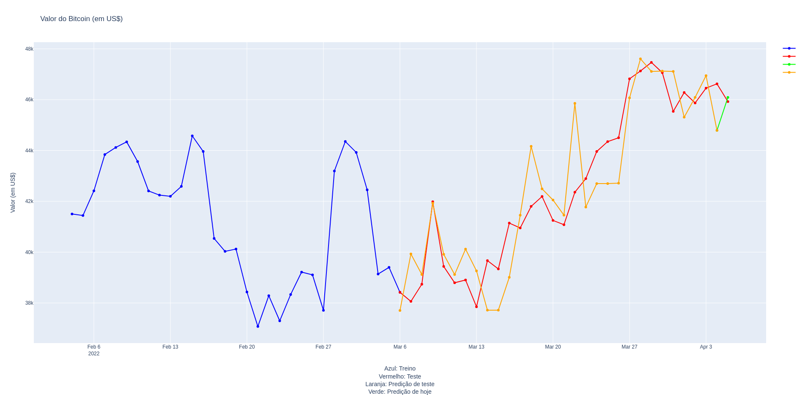

# Engenharia de Dados e Machine Learning com Airflow & PySpark

## Objetivo
Construir um pipeline completo de dados que extrai os valores do Bitcoin em um intervalo de cinco anos, que também faz predição de valores usando Machine Learning dentro de um intervalo de 30 dias, e dá como produto final um gráfico interativo do Plotly em formato HTML e uma tabela de dados de Bitcoin em um arquivo csv.  
  
Mais especificamente, o objetivo ao construir este repositório foi testar o Airflow com o Pyspark. A versão final está muito diferente do que eu havia planejado fazer, usando Programação Orientada a Objetos. Precisei fazer muitos ajustes pois tive muita dificuldade de fazer um código em nível mais atômico que tivesse uma boa integração entre Airflow e PySpark.  
  
A versão final se encontra no arquivo bitcoin_pyspark_dag.py.  
  
Em especial, o XCom do Airflow (que permite que você compartilhe variáveis entre diferentes funções dentro de uma DAG) não tem uma boa integração com DataFrames do Pyspark. Porém, pode ser que com o Pandas, por exemplo, seja uma ferramenta que funcione muito bem com o XCom. 
   
Usei a biblioteca de Machine Learning do PySpark chamada Mlib (pyspark.ml), e usei o modelo Gradient Boosting Tree Regressor para fazer a predição dos valores do Bitcoin, envolvendo também ajuste de hiperparâmetros deste modelo, como o número de árvores e cross-validation.  

## Recursos utilizados
- Visual Studio Code
- python3.9
- virtualenv
- pip3: gerenciador de pacotes python3.x

## Pacotes do Python
- airflow
- os
- datetime
- calendar
- plotly
- pandas
- pyspark

## Imagens do projeto

## Como executar localmente esse projeto em sua máquina
- baixe esse repositório localmente em sua máquina:  
> git clone https://github.com/rafaelcoelho1409/DataEngineering.git  
- Instale os pacotes necessários que estão no arquivo dataeng_requirements.txt:  
> pip3 install -r dataeng_requirements.txt  
- escolha seu interpretador python (python3, python3.x)  
- instale o airflow:  
> pip3 install apache-airflow  
- encontre a pasta de DAGs do Airflow na sua máquina (em geral, $AIRFLOW_HOME/dags)    
- copie e cole o arquivo bitcoin_pyspark_dag.py dentro desta pasta ($AIRFLOW_HOME/dags)  
- acesse o Airflow pelo seu navegador (https://localhost:8080)  
- ative a DAG e execute ela (Trigger DAG)  
- orientações mais completas de automatização de dados com Airflow:  
> https://airflow.apache.org/docs/apache-airflow/stable/tutorial.html
